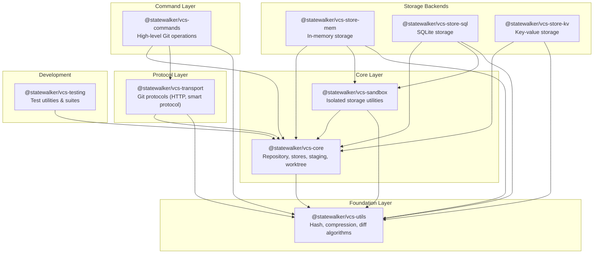

# Package Dependency Diagram

This diagram shows the dependency relationships between packages in the StateWalker VCS monorepo.

## Visual Diagram



## Dependency Table

| Package | Runtime Dependencies |
|---------|---------------------|
| `@statewalker/vcs-commands` | core, transport, utils |
| `@statewalker/vcs-transport` | core, utils |
| `@statewalker/vcs-store-mem` | core, sandbox, utils |
| `@statewalker/vcs-store-sql` | core, sandbox, utils |
| `@statewalker/vcs-store-kv` | core, utils |
| `@statewalker/vcs-sandbox` | core, utils |
| `@statewalker/vcs-core` | utils |
| `@statewalker/vcs-utils` | pako (external) |
| `@statewalker/vcs-testing` | core (devDependencies: vitest) |

## Layer Descriptions

### Foundation Layer

**@statewalker/vcs-utils** - Pure algorithmic implementations with no VCS-specific dependencies. Provides hashing (SHA-1, CRC32, rolling checksums), compression (zlib via pako), and diff algorithms (Myers diff, binary delta).

### Core Layer

**@statewalker/vcs-core** - The heart of the VCS system. Organized into four logical layers:

```
src/
├── common/    - Shared types (id, person, format, files)
├── storage/   - Binary storage (binary stores, pack files, delta compression)
├── history/   - Version control objects (blobs, trees, commits, tags, refs)
├── workspace/ - Working directory state (worktree, staging, status, checkout, ignore)
├── commands/  - High-level operations (add, checkout)
└── stores/    - Repository factory functions
```

Each layer builds on the ones below, with clear dependency boundaries

**@statewalker/vcs-sandbox** - Isolated storage utilities for safe experimentation and testing.

### Storage Backends

Multiple backends implementing core storage interfaces:
- **store-mem** - In-memory storage for testing and ephemeral operations
- **store-sql** - SQLite-based persistent storage (via sql.js)
- **store-kv** - Generic key-value store adapter for IndexedDB, LocalStorage, etc.

### Protocol Layer

**@statewalker/vcs-transport** - Git network protocols:
- Smart HTTP protocol (v1 and v2)
- Pack transfer and negotiation
- Server-side handlers (UploadPack, ReceivePack)
- HTTP server implementation (works with Deno, Cloudflare Workers, Node.js)

### Command Layer

**@statewalker/vcs-commands** - High-level Git operations that compose lower layers:
- Repository commands (init, clone)
- Working tree commands (add, status, checkout)
- History commands (commit, log, diff)
- Branch/tag commands (branch, tag, merge)
- Remote commands (fetch, push, pull)

## ASCII Diagram

For environments that don't render Mermaid:

```
                    ┌──────────────────┐
                    │    commands      │
                    │   (Git API)      │
                    └────────┬─────────┘
                             │
          ┌──────────────────┼──────────────────┐
          │                  │                  │
          ▼                  ▼                  ▼
┌─────────────────┐  ┌──────────────┐  ┌──────────────┐
│   transport     │  │  store-mem   │  │  store-sql   │
│  (protocols)    │  │  (testing)   │  │  (persist)   │
└────────┬────────┘  └──────┬───────┘  └──────┬───────┘
         │                  │                 │
         └──────────────────┼─────────────────┘
                            │
                            ▼
                   ┌──────────────────┐
                   │       core       │
                   │ (repository,     │
                   │  stores, packs,  │
                   │  staging, refs)  │
                   └────────┬─────────┘
                            │
                            ▼
                      ┌───────────┐
                      │   utils   │
                      │(algorithms)│
                      └───────────┘
```

## Recent Consolidation

The following packages were consolidated into `@statewalker/vcs-core` to simplify the architecture:
- Git filesystem storage → core
- Index/staging area → core
- Delta engine → core
- Filesystem traversal (worktree) → core

This consolidation reduces the number of packages while keeping the codebase organized with clear module boundaries within core.
