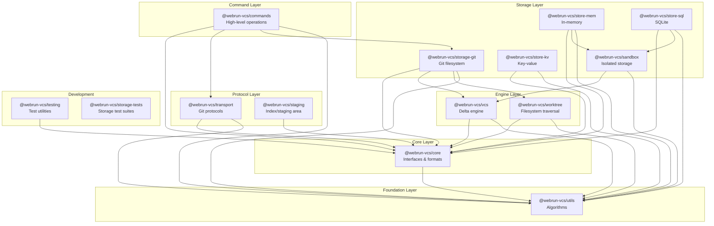

# Package Dependency Diagram

This diagram shows the dependency relationships between packages in the WebRun VCS monorepo.

## Visual Diagram



## Dependency Table

| Package | Dependencies |
|---------|-------------|
| `@webrun-vcs/commands` | core, transport, storage-git, utils |
| `@webrun-vcs/transport` | core, utils |
| `@webrun-vcs/staging` | core |
| `@webrun-vcs/storage-git` | core, vcs, worktree, utils |
| `@webrun-vcs/store-mem` | core, sandbox, utils |
| `@webrun-vcs/store-sql` | core, sandbox, utils |
| `@webrun-vcs/store-kv` | core, utils |
| `@webrun-vcs/sandbox` | vcs, utils |
| `@webrun-vcs/vcs` | core, utils |
| `@webrun-vcs/worktree` | core, utils |
| `@webrun-vcs/core` | utils |
| `@webrun-vcs/utils` | pako (external) |
| `@webrun-vcs/testing` | core |

## Layer Descriptions

### Foundation Layer
**@webrun-vcs/utils** - Pure algorithmic implementations with no VCS-specific dependencies. Provides hashing, compression, and diff algorithms.

### Core Layer
**@webrun-vcs/core** - Defines the VCS contracts: store interfaces, object model, pack file format, and delta compression system.

### Engine Layer
**@webrun-vcs/vcs** - Delta storage engine with candidate selection and compression optimization.
**@webrun-vcs/worktree** - Platform-agnostic filesystem traversal with ignore pattern matching.

### Storage Layer
Multiple backends implementing core interfaces:
- **storage-git** - Native Git `.git/` directory structure
- **store-mem** - In-memory storage for testing
- **store-sql** - SQLite-based persistent storage
- **store-kv** - Generic key-value store adapter
- **sandbox** - Isolated storage for safe experimentation

### Protocol Layer
**@webrun-vcs/transport** - Git smart HTTP protocol (v1/v2), pack transfer, server handlers.
**@webrun-vcs/staging** - Git index format, merge conflict tracking.

### Command Layer
**@webrun-vcs/commands** - High-level operations (clone, fetch, push, commit) that compose lower layers.

## ASCII Diagram

For environments that don't render Mermaid:

```
                    ┌──────────────────┐
                    │    commands      │
                    │   (CLI/API)      │
                    └────────┬─────────┘
                             │
          ┌──────────────────┼──────────────────┐
          │                  │                  │
          ▼                  ▼                  ▼
┌─────────────────┐  ┌──────────────┐  ┌──────────────┐
│   transport     │  │  storage-git │  │   staging    │
│  (protocols)    │  │ (filesystem) │  │   (index)    │
└────────┬────────┘  └──────┬───────┘  └──────┬───────┘
         │                  │                 │
         │           ┌──────┴───────┐         │
         │           │              │         │
         │           ▼              ▼         │
         │    ┌───────────┐  ┌───────────┐    │
         │    │  worktree │  │    vcs    │    │
         │    │  (files)  │  │  (engine) │    │
         │    └─────┬─────┘  └─────┬─────┘    │
         │          │              │          │
         └──────────┼──────────────┼──────────┘
                    │              │
                    ▼              ▼
              ┌───────────────────────┐
              │         core          │
              │ (interfaces, formats) │
              └───────────┬───────────┘
                          │
                          ▼
                    ┌───────────┐
                    │   utils   │
                    │(algorithms)│
                    └───────────┘
```
